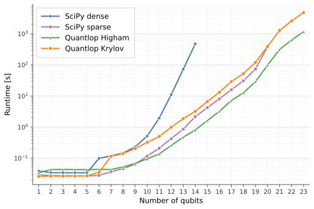
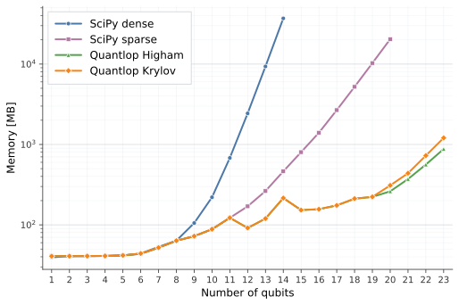
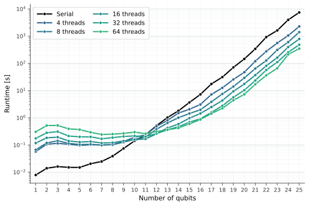
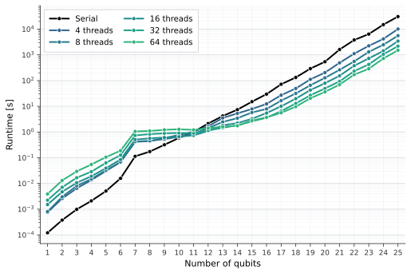

Benchmarks
==========

These benchmarks measure how the matrix-free algorithms implemented in ``quantlop``
scale with the number of qubits and with the number of OpenMP threads. They use
random Hamiltonians containing a fixed number of Pauli terms, an initial computational
basis state :math:`|0\ldots0\rangle`, and the default algorithm settings.
A fixed random seed makes the Hamiltonian sequence reproducible.

.. important::

   These measurements describe a specific machine and software environment.
   They are not hardware-independent performance guarantees.
   Use the scripts in ``benches/`` to measure performance on your own system. 

Comparison with SciPy
---------------------

This benchmark compares four different methods to compute :math:`e^{-iH}|0\ldots0\rangle`:

* ``scipy.linalg.expm`` constructs the dense matrix exponential and applies it
  to the state vector
* ``scipy.sparse.linalg.expm_multiply`` acts on the state using a sparse matrix
  representation of the Hamiltonian
* :func:`quantlop.evolve_higham` applies the Pauli-sum Hamiltonian directly
  using a scaled Taylor expansion
* :func:`quantlop.evolve_krylov` applies the Pauli-sum Hamiltonian directly
  using a Lanczos-Krylov projection

For each system size, the benchmark runs every available method several times.
The plots show the mean wall-clock runtime and mean increase in peak resident
memory. At the end of each run, the script checks that all results agree within
numerical tolerance.

.. raw:: html

   

    

The log scale exposes the exponential cost shared by all methods as the state
dimension :math:`2^n` grows. Avoiding an explicit Hamiltonian representation lets
the ``quantlop`` implementations run at sizes where the dense and sparse
algorithms used in this experiment are no longer practical.
For these Hamiltonians and default settings, the Higham method is faster than the
Krylov method at the largest measured sizes.

.. raw:: html

   

    

The dense approach grows especially quickly because a :math:`2^n\times2^n` dense
matrix requires :math:`O(4^n)` storage.
The sparse and matrix-free approaches avoid that dense operator representation.
In this experiment, both ``quantlop`` algorithms use substantially less memory at
the largest sizes shared with SciPy sparse. They still store dense state and work
vectors, so their memory use grows with :math:`2^n`.

Multi-thread scaling
--------------------

The multi-thread benchmark measures the Higham and Krylov performance running ``quantlop``
algorithms both in serial mode and with an increasing number of OpenMP threads.
The plots show elapsed runtime rather than parallel efficiency. Thread counts greater
than the available physical cores on a different machine may behave differently.

.. raw:: html

   

    

For both Higham (left) and Krylov (right) algorithms, thread-management overhead dominates small-size
simulations, while larger states provide enough work for OpenMP to reduce elapsed time,
with the highest thread counts achieving the shortest runtimes on the given machine.
